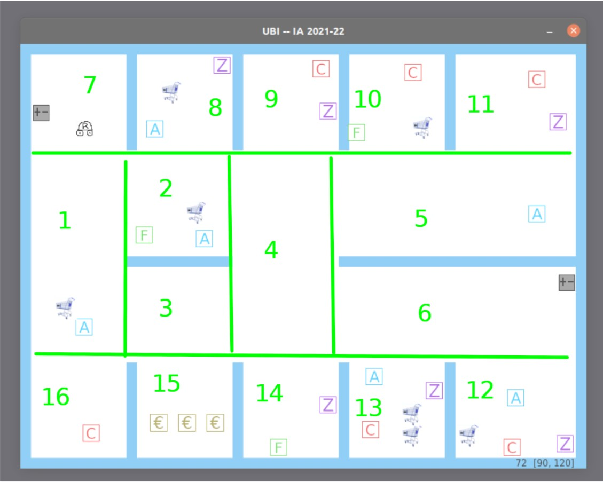

# Arrasta Parafusos

|        Nome        |  Numero  | Curso | Universidade |
|--------------------|----------|-------|--------------|    
|    Diogo Simões    | `a41266` |  LEI  |      UBI     |
|  Cristiano Santos  | `a43464` |  LEI  |      UBI     |

---

## Distribuição de Questões

|                    | **1** | **2** | **3** | **4** | **5** | **6** | **7** | **8** |
|--------------------|-------|-------|-------|-------|-------|-------|-------|-------|
|    Diogo Simões    |       |       |       |       |       |       |       |       |
|  Cristiano Santos  |       |       |       |       |       |       |       |       |

---
## Boundaries


|   No.    |   (X1, X2)   |   (Y1, Y2)   |
|----------|--------------|--------------|
|  **01**  | `(030, 135)` | `(165, 435)` |
|  **02**  | `(135, 285)` | `(165, 285)` |
|  **03**  | `(135, 285)` | `(285, 330)` |
|  **04**  | `(285, 435)` | `(165, 435)` |
|  **05**  | `(435, 770)` | `(165, 285)` |
|  **06**  | `(435, 770)` | `(285, 330)` |
|  **07**  | `(030, 135)` | `(030, 135)` |
|  **08**  | `(180, 285)` | `(030, 135)` |
|  **09**  | `(330, 435)` | `(030, 135)` |
|  **10**  | `(480, 585)` | `(030, 135)` |
|  **11**  | `(630, 770)` | `(030, 135)` |
|  **12**  | `(630, 770)` | `(435, 570)` |
|  **13**  | `(480, 585)` | `(435, 570)` |
|  **14**  | `(330, 435)` | `(435, 570)` |
|  **15**  | `(180, 285)` | `(435, 570)` |
|  **16**  | `(030, 135)` | `(435, 570)` |

---
## Questões

####  1. Qual foi a penúltima pessoa do sexo feminino que viste?

##### Sugestão de solução:
Distinguir sexo feminino pelo ultimo caracter.
Se 'a' então feminino.

Irmos dando `append` a uma lista o nome de cada pessoa que encontramos.
Quando for requesitada a resposta é percorrer a lista do fim para o inicio e a resposta será a segunda pessoa do sexo feminino.
Outra solução seria fazer uma lista para cada sexo. E assim seria apenas aceder ao elemento de indice -2 da lista de pessoas do sexo feminino.
Ou ainda simplesmente manter em memoria uma fila (lista) com apenas 2 elementos (um tuplo não porque são imutaveis). Sempre que apanharmos uma moça simplesmente vamos trocando.

* [X] **COMPLETED**

#### 2. Em que tipo de zona estás agora?

##### Sugestão de solução:
Durante o uso do robô se ele encontrar um item de "Zona" vai atraves das coordenadas atuais descobrir em que "sala" está e atribuir o tipo de zona.

Quando for requesitada a resposta é apenas necessario descobrir a sala em que estamos e se já tivermos encontrado que zona estamos então dá print a isso. Caso contrario dá print que ainda não temos essa resposta.

* [ ] **COMPLETED**

#### 3. Qual o caminho para a papelaria?

##### Sugestão de solução:
Um Grafo com cada aresta de onde estamos para onde passamos.
Utilizar Pesquisa de Primeiro em Profundidade (PPP) ou Pesquisa de Primeiro em Largura (PPL).

* [ ] **COMPLETED**

#### 4. Qual a distância até ao talho?

##### Sugestão de solução:
Talvez utilizando o grafo já feito anteriormente verificavamos o caminho pelas salas e depois o ponto mais proximo de cada sala. Até chegarmos ao talho. (isto se tivermos já encontrado a zona do talho)

* [ ] **COMPLETED**

#### 5. Quanto tempo achas que demoras a ir de onde estás até à caixa?

##### Sugestão de solução:
Calcular em media a velocidade. Pela distancia percorrida desde o inicio do programa. (Talvez pausar quando o bixo não se mexe)

Usar o mesmo metodo que a distancia do talho e descobrir a descobrir o tempo que seria gasto.

* [ ] **COMPLETED**

#### 6. Quanto tempo achas que falta até ficares com metade da bateria que tens agora?

##### Sugestão de solução:
Fazendo uma regressão linear. Por cada frame (execução da função work) adicionar o par (bateria, tempo).
Tempo seria definido pelo tempo desde que a bateria foi 100.
E no momento em que for pedido seria apenas buscar em y = (bateria atual / 2).

```python
from sklearn.linear_model import LinearRegression

y -> bateria
x -> tempo
```

Talvez reiniciar sempre que a bateria estiver a 100% ou juntar à media (media do declive da reta).

* [ ] **COMPLETED** 

#### 7. Qual é a probabilidade da próxima pessoa a encontrares ser uma criança?

##### Sugestão de solução:
Deve ser uma rede Bayesiana ~~ou uma Condicional~~. Esta deixo contigo @CRISphantom04

É uma rede bayesiana. A probabilidade de encontrar criança não é um evento independente. 

* [ ] **COMPLETED**

#### 8. Qual é a probabilidade de encontrar um adulto numa zona se estiver lá uma criança mas não estiver lá um carrinho?

##### Sugestão de solução:
Deve ser uma ~~rede Bayesiana ou uma~~ Condicional. Esta deixo contigo @CRISphantom04

É uma condicional.
```
A -> Adulto; B -> Criança; C -> Carrinho;
P(A|B,~C) = P(A^B^~C)/P(B^~C)
```

* [ ] **COMPLETED**

---
## Dependências

```bash
pip3 install pygame networkx numpy scipy scikit-learn pyAgrum
```